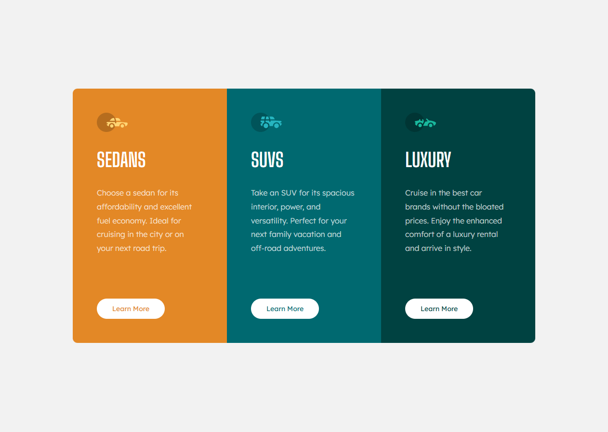

# 🚗 Car Categories UI

This is a simple and responsive frontend project that showcases three different categories of cars: **Sedans**, **SUVs**, and **Luxury Cars**. Each card highlights the unique benefits of the car type with clean design and accessible layout.

## 🔍 Features

- 🔹 Responsive layout using HTML & CSS
- 🔹 Three visually distinct sections with custom colors
- 🔹 Clear and modern typography
- 🔹 Hover-ready “Learn More” buttons
- 🔹 Organized and semantic HTML structure

## 📸 Preview

## 🧱 Technologies Used

- HTML5
- CSS3 (Flexbox)
- Google Fonts

Live Demo:
https://ziad-eid.github.io/3-column-preview-card-component/
